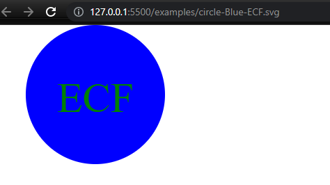

# svg-logo-maker
Creates an SVG image with user input, created with inquirer and jest libraries. Application passes 3 tests, can be run using command 'npm run jest'.

[Link to ScreenCastify video](https://drive.google.com/file/d/1VqkYwZWqyKupeU6FsrkgzVfCjFEccn8m/view)